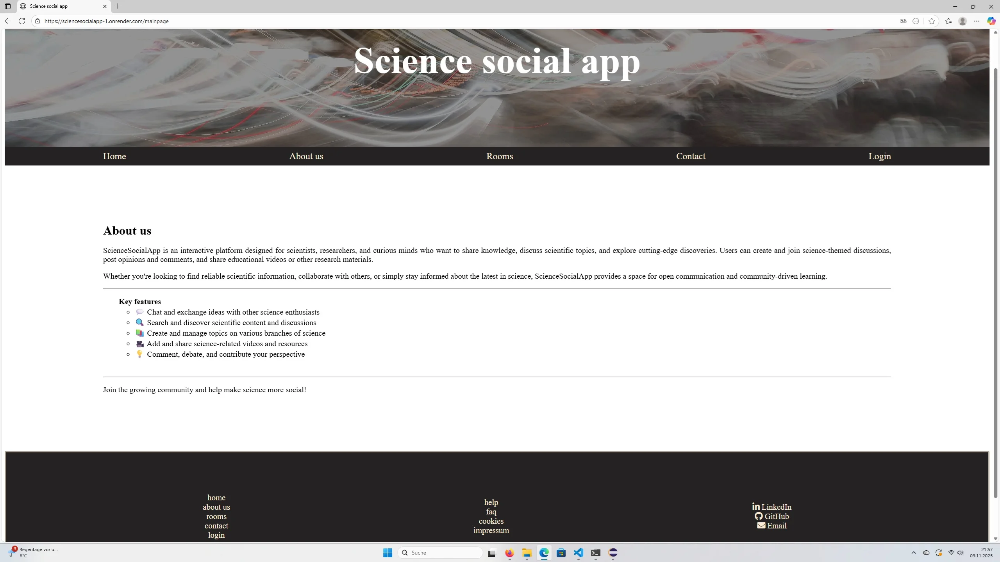

🧪 Science Social App

Science Social App is a social media platform designed for scientific purposes. Users can chat 💬, share videos 🎥, images 🖼️, and text posts 📝 to collaborate and discuss scientific topics.

🌟 Features

🔑 User registration and login

🏷️ Create and manage topics and posts

🎬 Share multimedia content (videos, images, text)

📡 Offline browsing of topics and posts

💬 Interactive chat for discussions and collaboration

🛡️ User permissions:

Registered users can create and comment on posts

All users can browse topics and posts offline

Only the project owner can approve code changes or updates

💻 Technologies & Languages

⚛️ Frontend: Angular, HTML5, CSS3, Typescript

🟢 Backend: Node.js, Spring boot

🍃 Database: h2database

☁️ Deployment: Render

🚀 Usage

You can try the app online: 🌐 [Science Social App](https://sciencesocialapp-1.onrender.com/)
